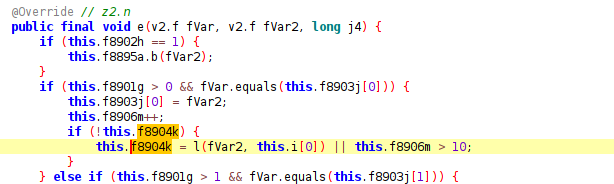

# Missed taps on Pixel 9

See #1.

The app has a bug (not caused by the patches) on my Pixel 9 Pro (running Lineage 22 built yesterday) where taps stop registering randomly (movement still works correctly). This becomes especially annoying when dragging stuff around with double-tap-drag. This is semi-reproducible as it happens frequently, but I'm not sure what the specific trigger is. Tapping repeatedly when this happens will eventually work.

This bug does not occur on my Pixel 8 or any of my motorola devices (all running Lineage 21).

The taps are visible with the developer options overlay.

Hooking RealVNC's InterceptingRelativeLayout onInterceptTouchEvent using Frida shows that the app still receives the touches as expected, but something in there fails to interpret it as a click.

I speculate that this may have something to do with pointer ID tracking, or possibly due to touch events getting filtered out by a buggy condition.

https://pgsk.dev/temp/wI54JaoMbGd/PIXEL-9-VNC-VIEWER-MISSED-TAPS-BUG.mp4


### How?

```javascript
// frida-trace -U -j 'com.realvnc.viewer.android.ui.input.InterceptingRelativeLayout!onInterceptTouchEvent' 'RVNC Viewer'
// versionCode=2070165

// note; z2.q seems to be the thing which actually processes the events, also add `z2.q!*`

defineHandler({
  onEnter(log, args, state) {
    const event = args[0]
    const motionEvent = {
        action: event['getAction'](),
        actionMasked: event['getActionMasked'](),
        pointerCount: event['getPointerCount'](),
        eventTime: event['getEventTime'](),
    }
    if (motionEvent.action == 2) {
        return // ACTION_MOVE
    }
    motionEvent['pointers'] = new Array(motionEvent.pointerCount).fill(0).map((_,i) => ({
        pointerId: event['getPointerId'](i),
        x: event['getX'](i),
        y: event['getY'](i),
        pressure: event['getPressure'](i).toFixed(2),
        toolType: event['getToolType'](i),
    }))
    log(`event(${JSON.stringify(motionEvent)})`);
    log(`... state ${JSON.stringify({
        u: this.u.value, // int
        q: this.q.value, // int
        r: this.r.value, // int
        l: this.l.value, // float
        m: this.m.value, // float
        n: this.n.value, // float
        o: this.o.value, // bool
        s: this.s.value, // bool
        t: this.t.value, // bool
    })}`)
  },
});

```

Successful tap:

```
2752314 ms  event({"action":0,"actionMasked":0,"pointerCount":1,"eventTime":"10302446","pointers":[{"pointerId":0,"x":377.25,"y":1349.25,"pressure":"0.18","toolType":1}]})
2752314 ms  ... state {"u":0,"q":0,"r":1,"s":false,"t":false}
2752315 ms  q.c("<instance: v2.f>", "10302446")
2752326 ms  q.e("<instance: v2.f>", "<instance: v2.f>", "10302456")
2752326 ms     | q.l("<instance: v2.f>", "<instance: v2.f>")
2752326 ms     | <= false
2752334 ms  q.e("<instance: v2.f>", "<instance: v2.f>", "10302464")
2752334 ms     | q.l("<instance: v2.f>", "<instance: v2.f>")
2752335 ms     | <= false
2752342 ms  q.e("<instance: v2.f>", "<instance: v2.f>", "10302472")
2752342 ms     | q.l("<instance: v2.f>", "<instance: v2.f>")
2752342 ms     | <= false
2752351 ms  q.e("<instance: v2.f>", "<instance: v2.f>", "10302481")
2752351 ms     | q.l("<instance: v2.f>", "<instance: v2.f>")
2752351 ms     | <= false
2752360 ms  q.e("<instance: v2.f>", "<instance: v2.f>", "10302489")
2752360 ms     | q.l("<instance: v2.f>", "<instance: v2.f>")
2752361 ms     | <= false
2752368 ms  q.e("<instance: v2.f>", "<instance: v2.f>", "10302497")
2752368 ms     | q.l("<instance: v2.f>", "<instance: v2.f>")
2752369 ms     | <= false
2752376 ms  q.e("<instance: v2.f>", "<instance: v2.f>", "10302506")
2752376 ms     | q.l("<instance: v2.f>", "<instance: v2.f>")
2752377 ms     | <= false
2752384 ms  q.e("<instance: v2.f>", "<instance: v2.f>", "10302513")
2752384 ms     | q.l("<instance: v2.f>", "<instance: v2.f>")
2752385 ms     | <= false
2752385 ms  event({"action":1,"actionMasked":1,"pointerCount":1,"eventTime":"10302517","pointers":[{"pointerId":0,"x":377.25,"y":1349.25,"pressure":"0.35","toolType":1}]})
2752385 ms  ... state {"u":0,"q":1,"r":2,"s":false,"t":false}
2752386 ms  q.d("<instance: v2.f>", "<instance: v2.f>", "10302517")
2752386 ms     | q.r(false)
2752386 ms     |    | q.k(1)
2752386 ms     |    | q.j()
2752386 ms     |    |    | q.q(0)
2752637 ms  q.i("<instance: z2.q>")
```

Failed tap (right after):

```
2753769 ms  event({"action":0,"actionMasked":0,"pointerCount":1,"eventTime":"10303897","pointers":[{"pointerId":0,"x":386.25,"y":1353,"pressure":"0.05","toolType":1}]})
2753769 ms  ... state {"u":0,"q":0,"r":1,"s":false,"t":false}
2753771 ms  q.c("<instance: v2.f>", "10303897")
2753784 ms  q.e("<instance: v2.f>", "<instance: v2.f>", "10303914")
2753784 ms     | q.l("<instance: v2.f>", "<instance: v2.f>")
2753784 ms     | <= false
2753792 ms  q.e("<instance: v2.f>", "<instance: v2.f>", "10303922")
2753792 ms     | q.l("<instance: v2.f>", "<instance: v2.f>")
2753792 ms     | <= false
2753800 ms  q.e("<instance: v2.f>", "<instance: v2.f>", "10303930")
2753801 ms     | q.l("<instance: v2.f>", "<instance: v2.f>")
2753801 ms     | <= false
2753809 ms  q.e("<instance: v2.f>", "<instance: v2.f>", "10303939")
2753809 ms     | q.l("<instance: v2.f>", "<instance: v2.f>")
2753809 ms     | <= false
2753817 ms  q.e("<instance: v2.f>", "<instance: v2.f>", "10303947")
2753817 ms     | q.l("<instance: v2.f>", "<instance: v2.f>")
2753817 ms     | <= false
2753826 ms  q.e("<instance: v2.f>", "<instance: v2.f>", "10303955")
2753827 ms     | q.l("<instance: v2.f>", "<instance: v2.f>")
2753827 ms     | <= false
2753834 ms  q.e("<instance: v2.f>", "<instance: v2.f>", "10303963")
2753834 ms     | q.l("<instance: v2.f>", "<instance: v2.f>")
2753834 ms     | <= false
2753842 ms  q.e("<instance: v2.f>", "<instance: v2.f>", "10303972")
2753842 ms     | q.l("<instance: v2.f>", "<instance: v2.f>")
2753843 ms     | <= false
2753851 ms  q.e("<instance: v2.f>", "<instance: v2.f>", "10303980")
2753851 ms     | q.l("<instance: v2.f>", "<instance: v2.f>")
2753852 ms     | <= false
2753859 ms  q.e("<instance: v2.f>", "<instance: v2.f>", "10303988")
2753859 ms     | q.l("<instance: v2.f>", "<instance: v2.f>")
2753859 ms     | <= false
2753867 ms  q.e("<instance: v2.f>", "<instance: v2.f>", "10303997")
2753867 ms     | q.l("<instance: v2.f>", "<instance: v2.f>")
2753867 ms     | <= false
2753869 ms  q.e("<instance: v2.f>", "<instance: v2.f>", "10303998")
2753869 ms  event({"action":1,"actionMasked":1,"pointerCount":1,"eventTime":"10304002","pointers":[{"pointerId":0,"x":386.25,"y":1353,"pressure":"0.09","toolType":1}]})
2753869 ms  ... state {"u":0,"q":1,"r":2,"s":false,"t":false}
2753869 ms  q.d("<instance: v2.f>", "<instance: v2.f>", "10304002")
2753870 ms     | q.r(false)
2753870 ms     |    | q.j()
2753870 ms     |    |    | q.q(0)

```

Most obvious difference is `q.r` not calling `q.k` before `q.j`... `q.r` disassembly:

```java
    public final void r(boolean z4) {
        int i = this.f8901g;
        if (i == 0) {
            return;
        }
        int i4 = i - 1;
        this.f8901g = i4;
        if (i4 == 0) {
            this.f8908o = false;
            TimerTask timerTask = this.f8917x;
            if (timerTask != null) {
                timerTask.cancel();
                this.f8916w.purge();
                this.f8917x = null;
            }
            int i5 = this.B;
            if (i5 > -1) {
                this.f8900f.b(i5);
                this.B = -1;
            } else {
                v2.l.n("TouchManager", "Asked to release mouse with no button pressed");
            }
            if (this.f8904k || this.f8905l || this.H || z4) {
                androidx.core.util.e eVar = this.f8895a;
                if (eVar.f() == 2 && !z4) {
                    if (((v2.f) eVar.e()).a((v2.f) eVar.e()) > 2.0f) {
                        this.D.e();
                    }
                    eVar.c();
                }
            } else {
                int i6 = this.f8902h;
                if (i6 == 1) {
                    k(1);
                } else if (i6 == 2) {
                    k(4);
                } else if (i6 == 3) {
                    k(2);
                }
            }
            j();
        }
    }
```

### Why?

Also tracing `z2.q!r`:

```javascript
defineHandler({
  onEnter(log, args, state) {
    log(`q.r(${args.map(JSON.stringify).join(', ')})`);
    log(`------ ${JSON.stringify({
        g: this['_g'].value, // if this is not 1, the rest of the method doesn't execute
        h: this['_h'].value, // this determines the arg to q.k -- it seems to be the number of concurrent touches (e.g., 3 for middle click)
        // if any of these are truthy, the branch is taken where the click isn't sent
        z4: args[0],
        k: this['_k'].value,
        l: this['_l'].value,
        H: this['H'].value,
    })}`)
  },
});
```

So the case where it doesn't work is when `k` is true. I wonder what that is...


The only thing which can set `k` to true is in `z2.q!e`:



Still need to figure out what k means, exactly, and why it gets set.

One thing q.e calls is this:


So maybe this has to do with the movement threshold? Let's log that too.

```javascript
// z2.q!l
defineHandler({
  onLeave(log, retval, state) {
    if (retval) {
        console.log("--- MOUSE MOVEMENT THRESHOLD REACHED")
    }
  }
});
```

But no, so it might be the second half of the OR condition, `z2.q.m`...

```javscript
defineHandler({
  onEnter(log, args, state) {
    log(`q.r(${args.map(JSON.stringify).join(', ')})`);
    log(`------ ${JSON.stringify({
        g: this['_g'].value, // if this is not 1, the rest of the method doesn't execute
        h: this['_h'].value, // this determines the arg to q.k -- it seems to be the number of concurrent touches (e.g., 3 for middle click)
        // if any of these are truthy, the branch is taken where the click isn't sent
        z4: args[0],
        k: this['_k'].value,
        l: this['_l'].value,
        H: this['H'].value,
        // stuff which affects k
        m: this['_m'].value,
        n: this['_n'].value,
    })}`)
  },
});
```

AHA... It's `m`, which goes over the threshold of 10 for some of the taps... But why is this now an issue?


So it gets incremented in `e`, which is called when...


A touch move event happens.

### Root Cause

**Thus, the root cause of this issue is that hardcoded threshold of 10 for the number of allowed ACTION_MOVE events between ACTION_DOWN and ACTION_UP to be interpreted as a tap is insufficient on the Pixel 9's extremely high resolution touchscreen.**

The simple way to work around this would be to record some values for a while and find a new threshold.

The proper way to fix this would be to change `m` into a float, then compute a score using the actual value of the move events rather than the number of them.

### Workaround

18 seems like a reasonable value to replace the hardcoded value in the lines like `this.k = ... || this.[m|n] > 10` in `z2.q.e` with ...

- a bunch of taps I did are under this (most are 11-12)
- taps with two and three fingers are much lower (most are under 5) (I do wonder why this is the case, though)
- the minimum value for what shouldn't be interpreted as an intentional tap is much higher (in the 40s on my Pixel 9, in the 30s on my Pixel 8 and Motos)

### Fix

TODO
